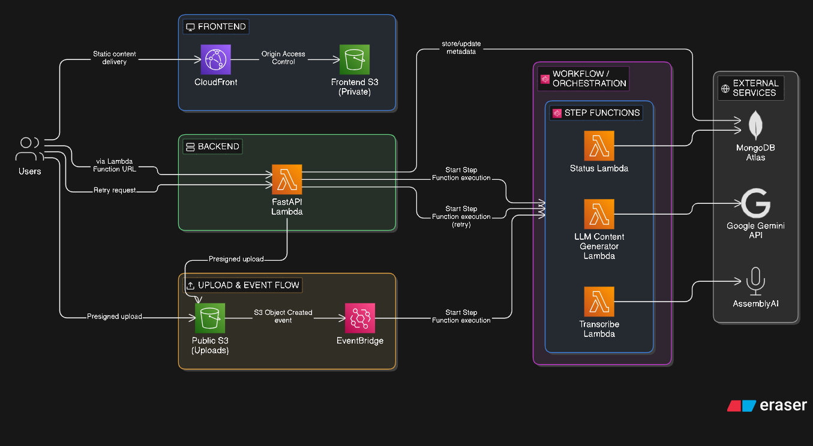
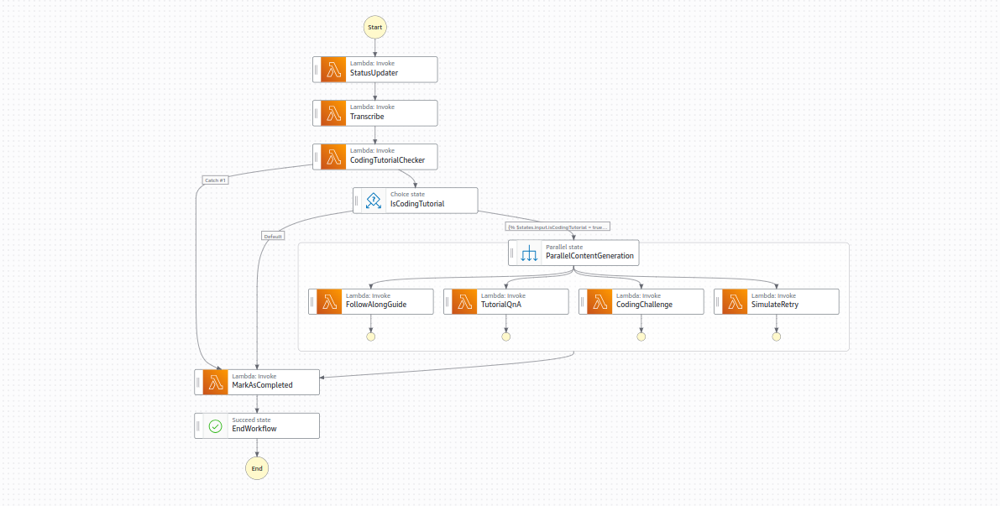

# AI Tutorial Processing Platform

Video tutorials are abundant, but passive consumption is a poor learning strategy.  
Developers often spend hours watching content without structured practice, validation, or reinforcement.

This project converts coding tutorials into **interactive learning artifacts**, enabling learners to move from passive watching → active implementation.

---

## 🚀 Live Demo

**Try it out:** [https://d3sasjrd2wswih.cloudfront.net/](https://d3sasjrd2wswih.cloudfront.net/)


## What Does This Do?

You upload a video tutorial. The system automatically:

1. **Transcribes** the audio to text
2. **Validates** it's actually a coding tutorial (not a vlog or unrelated content)
3. **Generates 4 types of learning materials** in parallel:
   - **Follow-Along Guide** - Step-by-step instructions to code along
   - **Q&A Set** - Questions and answers for knowledge checks
   - **Coding Challenge** - Practice problem based on the tutorial
   - **Summary** - Quick overview of what was covered

All of this happens automatically in ~2 minutes using AI, with no manual intervention.

---

## Architecture


### How It Works
```
User uploads video → S3 → EventBridge triggers workflow → Step Functions orchestrates:
  1. Transcribe audio (AssemblyAI)
  2. Check if it's a coding tutorial (Gemini AI)
  3. If yes → Generate 4 learning materials in parallel (Gemini AI)
  4. Save everything to MongoDB
```


---

## Key Technical Features

### 1. **Event-Driven Serverless Pipeline**

- Upload triggers automatically via S3 → EventBridge
- No servers to manage, scales automatically
- Pay only for what you use

### 2. **Parallel AI Processing**

Instead of sequential (slow):
```
Transcribe → Guide → Q&A → Challenge → Summary  // ~8 minutes
```

We do parallel (fast):
```
Transcribe → Validate → [Guide, Q&A, Challenge, Summary]  // ~2 minutes
                         ↑ All run at the same time
```

### 3. **Smart Retry System**

If one job fails (e.g., API rate limit on Q&A generation): Retrys only the failed job


## Tech Stack

| Layer | Technology |
|-------|------------|
| **API** | FastAPI + Lambda Function URL |
| **Orchestration** | AWS Step Functions (JSONata) |
| **Compute** | Lambda (Docker containers) |
| **Storage** | S3 (uploads), MongoDB Atlas (data) |
| **Events** | EventBridge |
| **CDN** | CloudFront |
| **AI** | Google Gemini, AssemblyAI |
| **IaC** | Terraform |

---
